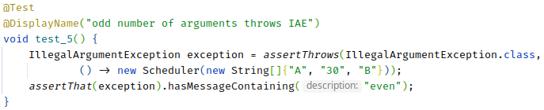

= Programmierpraktikum I: Übung 3
:icons: font
:icon-set: fa
:source-highlighter: rouge
:experimental:
ifdef::env-github[]
:tip-caption: :bulb:
:note-caption: :information_source:
:important-caption: :heavy_exclamation_mark:
:caution-caption: :fire:
:warning-caption: :warning:
endif::[]

== Funktionale Programmierung in Java

Diese Woche wollen wir uns mit der Stream-API beschäftigen und mit möglichst kleinen Funktionen
unsere Daten transformieren.

=== Zum Warmwerden

Zahlen in einer `range` erzeugen:: `IntStream.range(1, 10)` erzeugt einen Stream
von Integern, welcher Zahlen von 1 bis 9 erzeugt.

Mit der Funktion `forEach` können wir einzelne Elemente konsumieren und eine Funktion darauf anwenden:

[source,java]
----
IntStream.range(1, 10)
    .forEach(i -> System.out.println(i));
----

1. Für `i -> System.out.println(i)` gibt es eine Kurzschreibweise. Wie sieht diese aus? Probieren Sie die Schreibweise aus.

2. Statt die Zahlen auszugeben, können wir den Inhalt eines Streams auch in einer `List<Integer>` speichern. Ändern Sie den im Repo vorgegebenen Code entsprechend ab.
+
NOTE: Verwenden Sie `boxed()`. `IntStream` erweitert lediglich `BaseStream` und nicht `Stream`, weshalb wir https://docs.oracle.com/en/java/javase/17/docs/api/java.base/java/util/stream/Stream.html#toList()[`toList()`] erst dann verwenden können, wenn wir den `IntStream` mit `boxed()` in einen `Stream<Integer>` konvertiert haben.

=== Eigene Kollektoren

Wir wollen uns zur Übung einmal einen eigenen `Collector` schreiben.

* Implementieren Sie in der Klasse `ConfigParser` einen Collector, welcher den Inhalt der Datei `my_config.yml` Zeile für Zeile in eine `HashMap<String,String>` sammelt. Rufen Sie dafür `Collector.of`, oder die `collect`-Methode des Stream-Objekts mit passenden Funktionen auf:

1. `Supplier`: Funktion, welche (hier) eine neue Collection (`HashMap`) zum Sammeln der Daten erzeugt.
2. `BiConsumer`: Funktion, welche (hier) eine `HashMap` und das nächste Element (Zeile (`String`) der Datei) erhält.
3. `BiConsumer`: Funktion, welche zwei Teilergebnisse (``HashMap``s) in das erste Teilergebnis kombiniert (Einträge der zweiten `HashMap` zur ersten hinzufügt).

[TIP]
====
Sie können die vorgegebene `parseConfigLine` Methode nutzen um die Key-Value-Pärchen zu ermitteln:
[source,java]
----
  var entry = parseConfigLine(line);
  var key = entry.key;
  var value = entry.value;
----

Passen Sie auf, dass Sie keine zu riesigen Lambda-Ausdrücke schreiben. Versuchen Sie statische Hilfsmethoden zu schreiben, wo nötig und verwenden Sie Methodenreferenzen.
====

WARNING: Da https://de.wikipedia.org/wiki/YAML[YAML] https://docs.docker.com/compose/[sehr] https://docs.github.com/en/enterprise-server@3.5/actions/using-workflows/workflow-syntax-for-github-actions[ver] https://docs.gitlab.com/ee/ci/yaml/gitlab_ci_yaml.html[brei] https://docs.travis-ci.com/user/build-config-yaml[tet] ist und die Dateien im Allgemeinen wesentlich komplizierter aufgebaut sind als unser Beispiel, gibt es fertige Bibliotheken zum Einlesen von yml-Dateien. Benutzen Sie in der Praxis auf jeden Fall die fertigen Bibliotheken!
  

=== Arbeiten mit echten Daten

Es gibt viele Stream-Funktionen, die Sie mit der IDE kennenlernen können.
Das Arbeiten mit Streams kann einen Großteil Ihrer bisherigen „manuellen“ Arbeit mit Schleifen ersetzen.
Versuchen Sie ein Gefühl dafür zu bekommen welche Stream-Operationen
besonders nützlich sind und Ihnen in der alltäglichen Arbeit helfen können.
Mit den folgenden Aufgaben üben wir einige typische Operationen.

NOTE: Sie müssen während der Übung nicht alle Aufgaben schaffen. Nutzen Sie übrige Aufgaben gerne zur Klausurvorbereitung (es kommt garantiert irgendwas mit Streams in der Klausur vor!). Nach der Übung stellen wir auch einen Lösungsvorschlag online, mit dem Sie Ihren Lösungsweg vergleichen können.

In dem Beispielprojekt finden Sie eine `punkte.csv`-Datei, welche fiktive
Klausurergebnisse beinhaltet. Diese Datei soll nun eingelesen und ausgewertet
werden. Wir arbeiten dazu in der Klasse `Punkte`.

==== Aufgaben

* Ermitteln Sie die Anzahl der Zeilen und geben Sie sie auf der Konsole aus.
+
NOTE: Das geht auch ohne einen Stream.

* Geben Sie die Namen aller Studis aus.

** Es handelt sich hier um Daten, die mit einem Komma separiert sind. Bringen
Sie die Daten in eine verwertbare Struktur, indem Sie die einzelnen Zeilen
(Strings) nach einem Komma splitten. Die Funktionen `map` und `split()` können
hierbei helfen. Beispiel zum Teilen eines Strings bei Kommata:
+
[source, java]
----
final String[] foobar = "Foo,Bar,Fozz".split(",");
----
+
Im Array `foobar` befinden sich dann die drei Strings `"Foo"`, `"Bar"` und `"Fizz"`.
+
// * Geben Sie die einzelnen Zeilen aus.
** Geben Sie nur die Namen der Studis aus:
+
TIP: Überspringen Sie die erste Zeile mit `skip(1)`.

** Beschränken Sie die Ausgabe auf die ersten fünf Namen, damit die Standardausgabe nicht zu unübersichtlich wird. (Die relevante Stream-Methode beginnt mit `l`.)
* Berechnen Sie, welche Studis mindestens 50 Punkte in einer Klausur
  hatten.
* Seien Sie kreativ und analysieren Sie die Daten. Wie viele Studis sind
  durchgefallen? Wie viele haben die Hauptklausur geschrieben?

NOTE: Wie hätte Ihr Code unter Nutzung von Schliefen ausgesehen? Übersichtlicher? Besser nachvollziehbar? Ihr IDE kann evtl. automatisch den Stream-Code in Schleifen-Code umformen.

WARNING: Auch für CSV gilt: Das Format sieht auf den ersten Blick einfach aus, ist aber tatsächlich https://datatracker.ietf.org/doc/html/rfc4180#section-2[komplizierter]. Verwenden Sie in der Praxis eine Bibliothek zum Einlesen von CSV-Dateien.
  

==== Weitere Datenverarbeitung

Wir haben eine zweite Datei `studis.txt`, welche wieder (natürlich keine echten) Studidaten
enthält. Das Format hier ist `Vorname Nachname Fach Übungspunkte Klausurergebnis_in_Prozent`.
Wie Sie die Aufgaben lösen, ist Ihnen frei gelassen, aber probieren
Sie möglichst verschiedene Ansätze mit der Stream-API aus.

* Finden Sie die Gesamtzahl der Studis, welche die Zulassung erhalten haben (Punkte > 300).
* Geben Sie den Mittelwert aller Punkte der Studis aus, welche die Zulassung erhalten haben.
+
WARNING: Stream-Objekte können nicht wiederverwendet werden. (Ja, das ist schade.) Die Klasse `IntStream` hat aber eine praktische Methode `summaryStatistics`.

* Geben Sie die Anzahl der Personen aus, die Informatik studieren.
* Geben Sie die Namen aller Informatiker:innen aus. Versuchen Sie eine Lösung mit `filter` und eine mit `collect(groupingBy(...))` zu finden.
// * Geben Sie die Namen aller Personen aus, aber ersetzen Sie „Informationswissenschaften“ durch „Computerlinguistik“.
* Geben Sie eine sortierte Liste aller Studiengänge aus. Geben Sie jedes Fach nur einmal aus:
----
Anderer
Informatik
Informationswissenschaften
Mathematik
Physik
----
* Zählen Sie die Häufigkeit jedes Studiengangs (Ausgabereihenfolge beliebig):
+
----
  22 Anderer
 359 Informatik
  73 Informationswissenschaften
  33 Mathematik
  46 Physik
----
+
TIP: Verwenden Sie `printf` und den Platzhalter `%4d`, um eine bis zu vierstellige Zahl rechtsbündig auszurichten.

* Sortieren Sie die Fächer in absteigender Reihenfolge nach der Häufigkeit:
+
----
 359 Informatik
  73 Informationswissenschaften
  46 Physik
  33 Mathematik
  22 Anderer
----
+
TIP: Eine Möglichkeit: Verwenden Sie das Ergebnis von `groupingBy` und streamen Sie über das `keySet`.

=== Zusatz: Reduce

* Nutzen Sie die Stream-API, um den größten gemeinsamen Teiler (greatest common divisor, GCD) einer Integer-Liste zu berechnen. Da es sich um eine immutable reduction handelt, sollten Sie eine Lösung mit `reduce` statt `collect` verwenden.
+
NOTE: Implementieren Sie GCD nicht selbst. Wandeln Sie alle `Integer` in `BigInteger` um (mit der Factory-Methode `BigInteger.valueOf`) und nutzen Sie die eingebaute `gcd`-Methode.

* Knobelaufgabe: Kann dieselbe Funktionalität auch mit `collect` umgesetzt werden?
+
NOTE: Sie müssen für einen Collector den Wert, in den Sie akkumulieren, verändern.
Java-Integer sind immutable, daher gibt es hier Probleme. Nutzen Sie einen ähnlichen Trick
wie die https://github.com/openjdk/jdk/blob/master/src/java.base/share/classes/java/util/stream/Collectors.java#L677[Standard-Implementierung von `summingInt`] und verwenden Sie einen `AtomicInteger`, welches
sich sicher verändern lässt, oder ein Integer-Array.
+
WARNING: Dass `summingInt` ein Array verwendet, hat Performance-Gründe. Sie würden in der Praxis hier `reduce` verziehen, es sei denn Sie haben gemessen, dass `reduce` die Geschwindigkeit Ihrer Anwendung signifikant beeinflusst.

=== Zusatzmaterial

* https://mediathek.hhu.de/watch/5aaf4a79-5542-4c44-994d-93f6075ffd22#[Was steckt konzeptionell hinter den Lambda-Objekten?]

== Tipp der Woche: Rainbow Brackets

Wenn an einer Stelle sehr viele (v.a. schließende) Klammern aufeinandertreffen, kann man schnell den Überblick verlieren, welche öffnende Klammer zu welcher schließenden Klammer gehört. Oft kann hier das Einführen einer neuen Variablen mehr Übersicht verschaffen. Für alle anderen Fälle kann man in vielen Editoren (ggf. per Plugin) zusammengehörige Klammern in einer eigenen Farbe anzeigen lassen:

